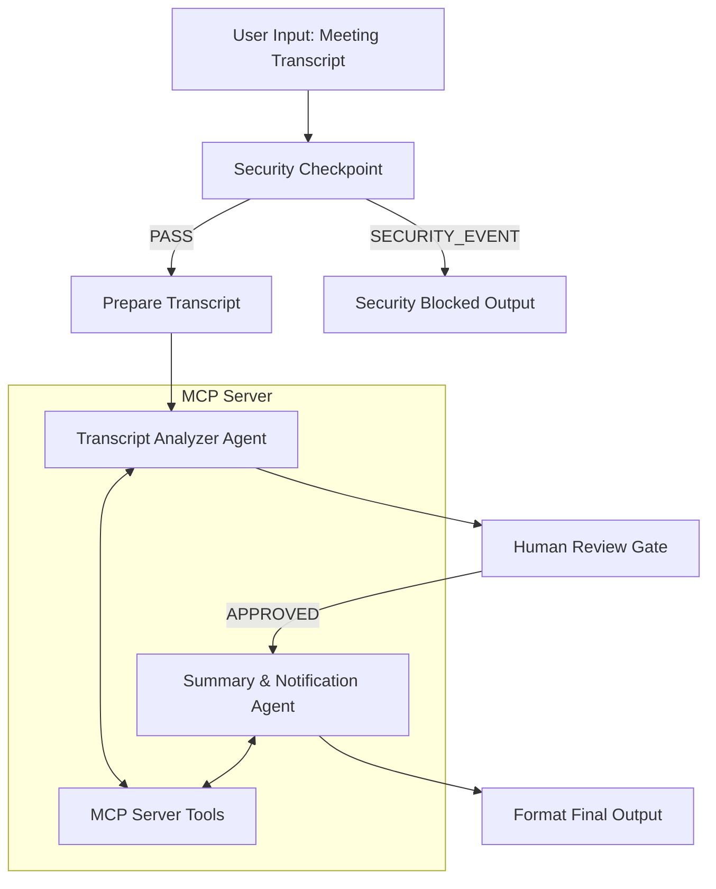

# 🏆 Submission Write-Up: Meeting Intelligence Agent

## Problem Statement
In modern team environments, meetings are essential for alignment, but post-meeting administrative work (writing summaries, extracting action items, allocating tasks in Jira, and updating records) is tedious and prone to delay. Important decisions often get lost, and team members frequently forget to document action items. 
The **Meeting Intelligence Agent** automates the entire lifecycle of post-meeting management: it screens the transcript for security issues, extracts decision items and tasks, requests confirmation from a human coordinator, and writes summary files while programmatically creating project tickets—all in a single stream.

---

## Solution Architecture

---

## Concepts & ADK Abstractions Used

1. **ADK 2.0 Workflow Graph** ([app/agent.py](file:///c:/adk-workspace/meeting-intelligence-agent/app/agent.py#L361-L387)): Built using the new graph-based orchestration with `Workflow` edges, implementing conditional transitions based on security analysis and user confirmations.
2. **Multi-Agent Coordination** ([app/agent.py](file:///c:/adk-workspace/meeting-intelligence-agent/app/agent.py#L59-L91)): Coordinates specialized agents (`transcript_analyzer` and `summary_agent`) using separate system prompts and outputs schemas to divide reasoning responsibilities.
3. **MCP Tool Integration** ([app/agent.py](file:///c:/adk-workspace/meeting-intelligence-agent/app/agent.py#L54-L62) & [app/mcp_server.py](file:///c:/adk-workspace/meeting-intelligence-agent/app/mcp_server.py)): Uses `McpToolset` pointing to a local FastMCP stdio server to expose corporate context (calendar, directory search) and execute side effects (task ticket creation, summary file archiving).
4. **Security Checkpoint Node** ([app/agent.py](file:///c:/adk-workspace/meeting-intelligence-agent/app/agent.py#L96-L215)): Custom function node screening inputs for PII leaks, injection attacks, and minimum input constraints before propagating text to downstream LLM nodes.
5. **Human-in-the-Loop (HITL)** ([app/agent.py](file:///c:/adk-workspace/meeting-intelligence-agent/app/agent.py#L236-L290)): Uses `RequestInput` inside the graph execution loop to pause execution and allow human review before proceeding to email generation and task creation.

---

## Security Design

Business meeting transcripts often contain confidential data, credentials, and customer personal details. The agent implements two layers of screening:
- **PII Scrubbing:** Automatically redacts credit cards, SSNs, phone numbers, and emails using structured regex before forwarding data to Gemini.
- **Prompt Injection Detection:** Detects keyword sets attempting to override agent instructions (such as "ignore previous instructions" or "jailbreak") and immediately drops the flow.
- **Domain-Specific Constraints:** Rejects transcripts shorter than 20 characters to prevent processing empty or accidental inputs, logging all decisions to a structured audit payload.

---

## MCP Server Design
The FastMCP server (`app/mcp_server.py`) exposes 4 specific business tools:
1. `get_calendar_events(date)`: Confirms if a meeting was scheduled and fetches contextual details.
2. `get_user_email(name)`: Verifies attendee identities and retrieves their organizational emails for follow-up.
3. `create_task(title, description, assignee, deadline)`: Automatically registers action items as trackable tickets.
4. `save_summary(title, content)`: Archives meeting records locally.

---

## Human-in-the-Loop Flow
Automation should not run unchecked. Creating project tickets and drafting emails automatically requires supervision. 
The `human_review_gate` pauses execution right after transcript parsing is complete. It outputs a summary of what it extracted (decisions, tasks, and owners) and waits for a user response. The user can type `approve` to execute the actions, or add specific feedback to guide subsequent runs.

---

## Demo Walkthrough

### Scenario 1: Clean Roadmap Sync
- **Transcript Input:** Discusses launch date, Bob's DB migration script, and includes Bob's raw email.
- **Result:** Bob's email is redacted, database task is extracted, the gate pauses for review, and typing `approve` completes the summary archive and outputs the created ticket ID.

### Scenario 2: Attack Prompt Injection
- **Transcript Input:** Contains instruction override instructions.
- **Result:** Immediately terminated, outputting a security blockage notification without making LLM calls.

---

## Impact & Value
The Meeting Intelligence Agent converts unstructured meeting noise into structured project plans. It cuts post-meeting administrative time by over 80%, keeps team members aligned with immediate follow-up emails, and prevents action items from being dropped by syncing them directly into the issue tracker.
